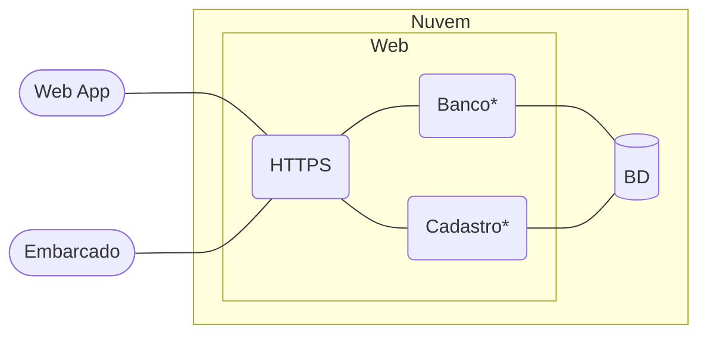

# Serviços em nuvem

Parte da solução a rodar em nuvem.

## Requisitos do sistema composto pelo serviços em nuvem

Os requisitos são os seguintes:

1. O sistema deve possuir acesso a partir de qualquer endereço IPv4 ou IPv6.
1. O sistema deve atender a requisições pela Internet via padrões REST API sobre HTTPS.
1. O sistema deve prever uma interface de usuário para cadastro e manutenção da sua conta.
1. O cadastro de usuário deve ser feito com mecanismo externo de validação de email, como por exemplo [OAuth](https://oauth.net/2/), e posterior preenchimento dos demais dados, como por exemplo apelido e senha.
1. O sistema deve ter suporte a escalabilidade para atender a picos momentâneos de demanda.
1. O sistema deve possuir um banco de dados central, que pode, caso necessário, ser replicado no todo ou em parte nos dispositivos terminais para eventualidades de falha de conectividade.
1. O sistema deve prever mecanismos de sincronização bidirecional para a sincronização dos dados do banco central e terminais.
1. O banco de dados deve armazenar dados de usuário, dispositivos terminais (quando necessário) e produtos para venda.
1. Todos os dados armazenados no banco (usuários e senhas, dispositivos terminais e produtos para venda) devem ter padrão numérico de 4 dígitos.
1. O sistema deve permitir o acesso remoto aos dados de usuários nos dispositivos terminais mediante autenticação externa de email ou o par usuário + senha.
1. Aplicações Web podem usar ambos os mecanismos de autenticação (externa por email e par usuário+senha).
1. Dispositivos terminais microcontrolados devem possuir teclado numérico aparente para o preenchimento de usuário e senha numéricos e, assim, aunteticar o usuário para realizar as operações na máquina local.

## Arquitetura da solução

O acesso é padronizado para microprocessados (aplicações Web) e microcontrolados, baseado em REST API + JSON, uma vez que o sentido das mensagens é, basicamente, do cliente para o servidor. Os blocos com asterisco (`*`) são aplicações a serem desenvolvidas ao longo do projeto:

- Cadastro: cadastro e manutenção de conta de usuário;
- Banco: operador financeiro, o banco do sistem econômico.

